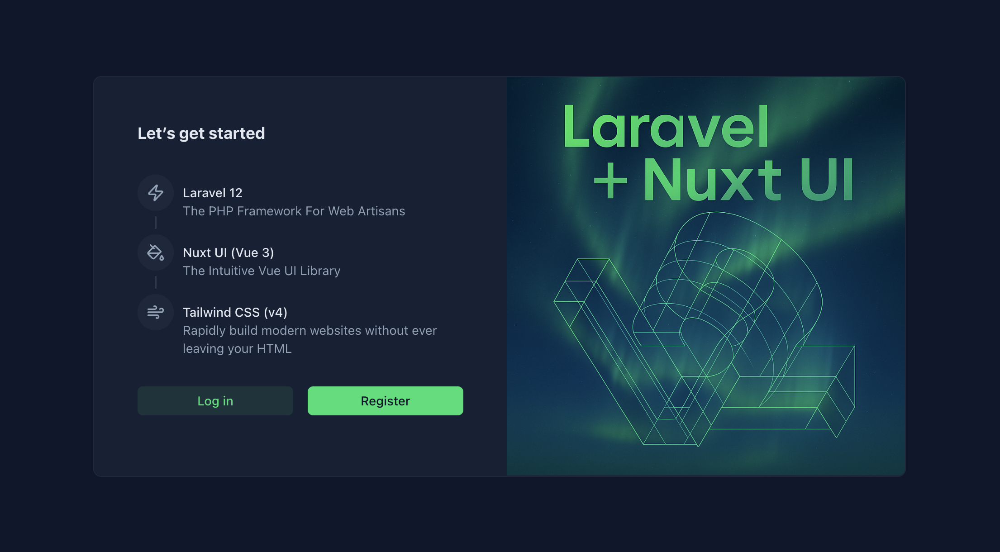

## Nuxt UI Starter

A Laravel starter kit using Nuxt UI!



## Installation

You can use the [Laravel Installer](https://laravel.com/docs#installing-php) to install Genesis.

```bash
laravel new my-app --using=stursby/nuxt-ui-starter
```

Then, run `comopser run dev` to run the asset watcher, and you're good to go!

## Built With

Below is a list of all the technologies that Genesis has been **built with**:

- [Laravel](https://laravel.com)
- [Inertia.js](https://inertiajs.com)
- [Nuxt UI](https://ui.nuxt.com)
- [TailwindCSS](https://tailwindcss.com)

## License

The MIT License (MIT). Please see [License File](https://github.com/stursby/nuxt-ui-starter/blob/main/LICENSE) for more information.
